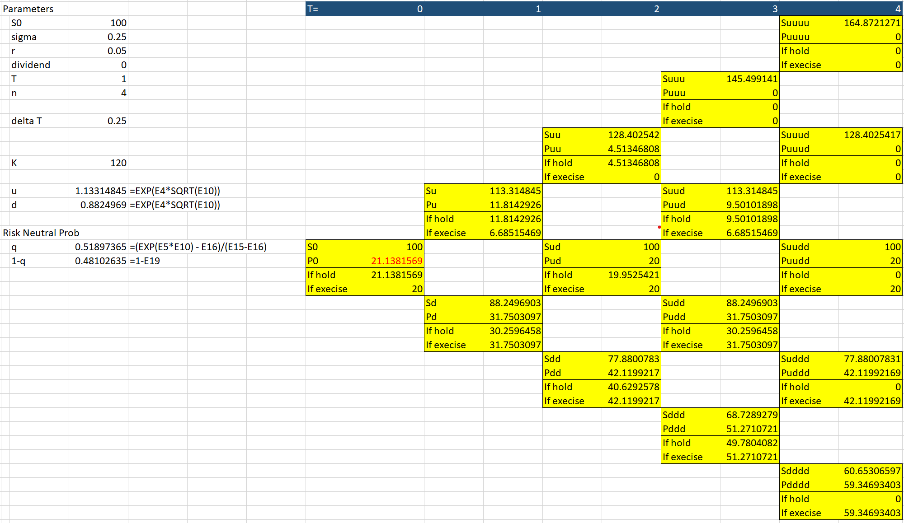

# Option Pricing

> This repository is mainly designed for those who want to study option pricing.
> It is built purely on standard NumPy and SciPy packages.
>
> I've tried my best to utilize the speed offered by NumPy array operations rather than using multiple for-loops,
> without sacrificing the ability to refer the code back to the equations in the textbook.
 

## Monte Carlo Simulation

How to use: `example_monte_carlo.py`

* `stock_price_simulation()`
* `stock_price_simulation_with_poisson_jump()`

## Black-Scholes-Merton (BSM)

How to use: `example_BSM.py`

* European call `call_value()`, European put `put_value()`
* (class) `GarmanKohlhagenForex`
* implied volatility assume BSM model `implied_vol()`
* Merton jump diffusion `merton_jump_diffusion()`
* Exotic options (barrier options) `cash_or_nothing_barrier_options()`
* `delta()`, `gamma()`, `theta()`, `vega()`, `rho()`, `psi()`

 

## Binomial Excel Illustration

 

    

The final predicted price is the average of all simulated prices at time T (column T).

| Stock price S | h | 2h  | 3h | ... |T-h|                T |
|:-------------:|:---------:| -----:| -----:| -----:| -----:|-----------------:|
| simulation 1  |   |   |  |  |  |  S1,T |
| simulation 2  |   |   |  |  |  |  S2,T |
| simulation 3  |   |   |  |  |  |  S3,T |
|      ...      |   |   |  |  |  |              ... |

* `vasicek()` and `cox_ingersoll_ross_model()`: stochastic interest rate (work-in-progress).
* `heston()`: stochastic volatility.

Note: the default case is two tables with constant values. Call these two functions before
running `stock_price_simulation()`.

| Volatility &sigma; | h | 2h  | 3h | ... |T-h|                     T |
|:------------------:|:---------:| -----:| -----:| -----:| -----:|----------------------:|
|    simulation 1    |   |   |  |  |  | &sigma;1,T |
|    simulation 2    |   |   |  |  |  | &sigma;2,T |
|    simulation 3    |   |   |  |  |  | &sigma;3,T |
|        ...         |   |   |  |  |  |                   ... |

